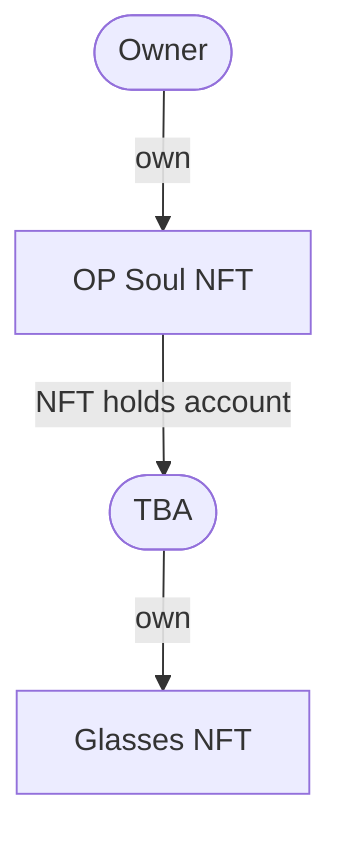

# OP Soul

## Concept

**Full On-Chain Dress-Up NFT**
- The NFT is divided into two parts: OP Soul (in this case, bear) and glasses. By combining these parts, one complete artwork is created.
- We made good use of ERC6551, and the glasses NFT are stored in the TokenBound Account of the OP Soul NFT.
- The owner can select assets within the TokenBound Account (TBA) to dress up the OP Soul (bear).
- This is trial to let NFT to possess assets and to behave like a human.

## Technology

### structure

### Process

The artwork is completed through the following process
- Mint the OP Soul NFT.
- Create a Token Bound Account for the minted OP Soul NFT.
- Send the glasses NFT to the Token Bound Account (TBA).
- Change the status of the glasses NFT in the Token Bound Account to 'equipped' or 'de-equipped'.
- It is possible to change the glasses NFT to different patterns.

### tool

- **ERC6551**  
We have adopted ERC6551 as the core technology for our Generative projects. By utilizing ERC6551, we are able to programmatically create artworks composed of multiple parts. Additionally, we have modified ERC6551 in a way that suits the creation of Generative Art. Specifically, we have enabled the setting of an 'equipped or not' status of assets within the TokenBound Account. The change in the 'equipped or not' status is performed by user operations. This has made it possible to manage the state of Art on-chain, and enables NFT to freely possess assets (in our case, glasses).

##  On-Chain Data

### Op Mainnet

| Contract Name     | Address                                      | Note                         |
| :---------------- | :------------------------------------------- | :--------------------------- |
| `OP Soul NFT`     | `0x44E4a35393Beba95806c2F8061DE9B18BCbe9B06` | Main NFT (bear image)        |
| `Glasses NFT`     | `0xB0C4aF27bC604724B9692463E6a6801eCAD61375` | TBA of OP Soul NFT owns      |
| `ERC6551Account`  | `0xAa3FDEB44B7bb1C0A366685c0A10b1a2aEa6548C` |                              |
| `ERC6551Registry` | `0x35B9B2B23f01452eab2095d074966F99A1d1aAd0` |                              |

### Sepolia testnet

| Contract Name     | Address                                      | Note                         |
| :---------------- | :------------------------------------------- | :--------------------------- |
| `OP Soul NFT`     | `0x858115d4B961419C4195CA5c74d120f60764d3FB` | Main NFT (bear image)        |
| `Glasses NFT`     | `0x1A5eDBfB1e43661262b5c33Dcc3887bA45D99791` | TBA of OP Soul NFT owns      |
| `ERC6551Account`  | `0x0188A9357881892371aBa483077f80bF73CaaDf4` |                              |
| `ERC6551Registry` | `0xC62Ab8B002DEa3397B35C2e80852AC87c19Dc320` |                              |

### Transaction

TX on Sepolia

| TX Name                 | Tx Hash                                                              | Note                                               |
| :---------------------- | :------------------------------------------------------------------- | :------------------------------------------------- |
| `Minting OP Soul`       | `0x7656006d89c428bca6d10478c7bed880e2bf94613f86670d8046d9a97a46c7fc` | Mint OP Soul NFT    　        　　　　　　　　　　　　　|
| `Minting Glasses NFT`   | `0x12297d39fcfe324ff2bc093a3e89084085ee305b05676ccfabd7b022b970fce6` | Mint glasses NFT to TBA of OP Soul NFT      　　　　|
| `wearing glasses`       | `0x1dc0f015850835e9a37f6d124e1dd8a865c1279326c5bde5e36c0b2c54fb157f` | metadata of OP Soul NFT changed programmatically   |
| `taking off glasses`    | `0x0a496782dcecfb1c6012681dd6866d99ed831fe58249ae7254dea10421179ce2` | metadata of OP Soul NFT changed programmatically   |
